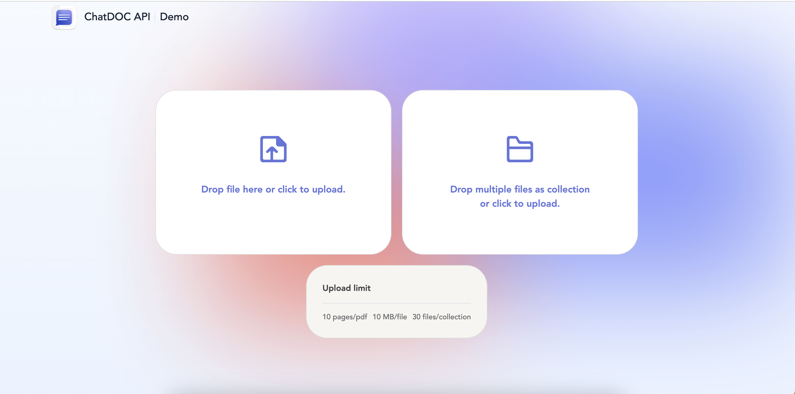

# ChatDOC_API_Demo

## Environment

- Node.js >= 16.x
- pnpm >= 8.x

## Installation

run `pnpm install`

## Custom server environment

- Set the env variable PROXY_API_KEY 

  > **PROXY_API_KEY**  is the API key that you obtained after purchasing the API package or membership plan.

  To set the PROXY_API_KEY, you can use the command line.
  
  For Linux and macOS
  ```sh
  export PROXY_API_KEY=xxx
  ```
  For Windows
  ```sh
  set PROXY_API_KEY=xxx
  ```
  Alternatively, you can use a .env file to set the PROXY_API_KEY variable. Here's how:

  1. run `cp ./projects/server/.env.template ./projects/server/.env`

  2. Fill in PROXY_HOST in the .env file.


## Getting started

run `pnpm start`



